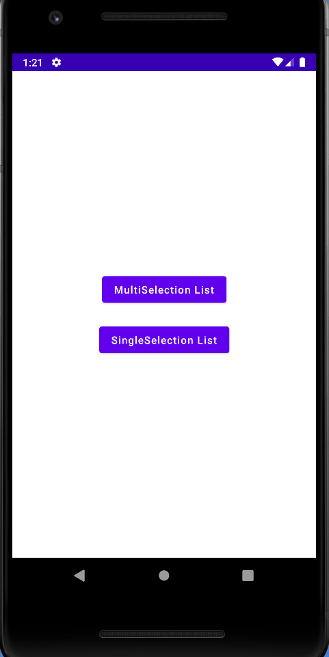

# Compose

A Complete Jetpack compose related Repository.

For more information, please [read the documentation](https://developer.android.com/jetpack/compose)

💻 Requirements
------------
To try out these sample apps, you need to use [Android Studio](https://developer.android.com/studio)
. You can clone this repository or import the project from Android Studio following the steps
[here](https://developer.android.com/jetpack/compose/setup#sample).

🧬 Sample
------------
Single Selection in Lazy Columns
 
